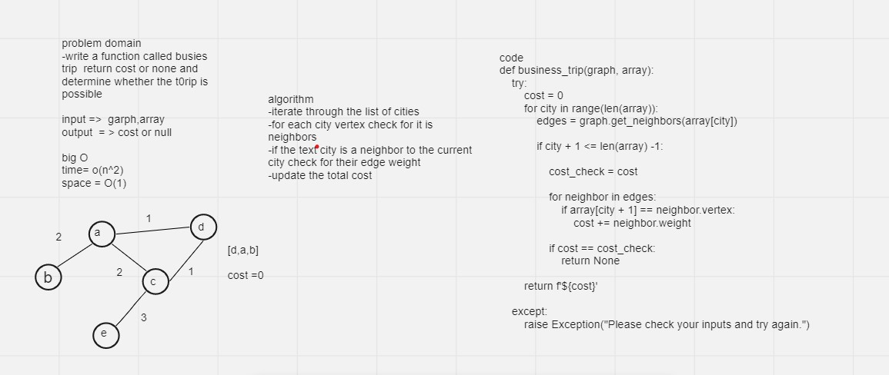
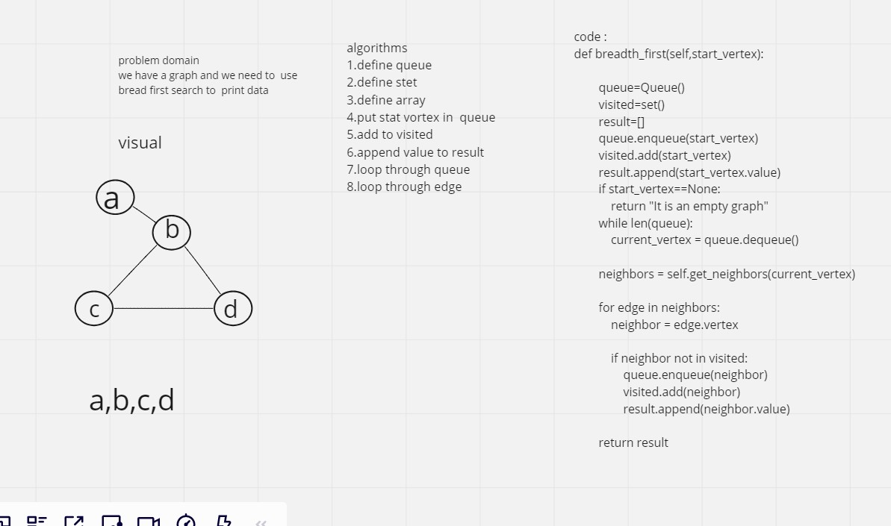

# Challenge Summary
<!-- Description of the challenge -->
<!-- Write the method for the Graph class:

breadth first
Arguments: Node
Return: A collection of nodes in the order they were visited.
Display the collection -->
Given a business trip itinerary, and an Alaska Airlines route map, is the trip possible with direct flights? If so, how much will the total trip cost be?

business_trip - Arguments: graph : (list) => list of cities - Returns cost or None

## Whiteboard Process
<!-- Embedded whiteboard image -->

<!--  -->