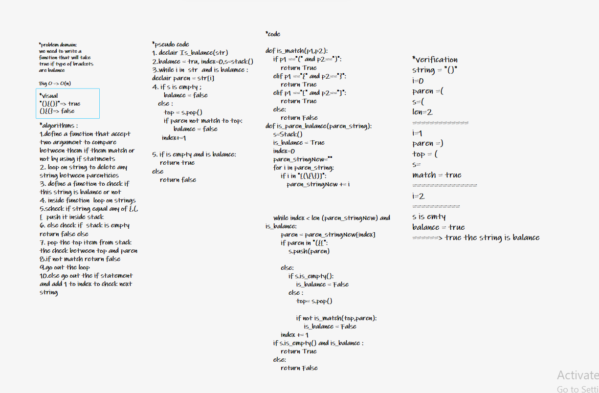

# Challenge Summary

<!-- Description of the challenge -->

Write a function called validate brackets
Arguments: string
Return: boolean
representing whether or not the brackets in the string are balanced

## Whiteboard Process

<!-- Embedded whiteboard image -->
